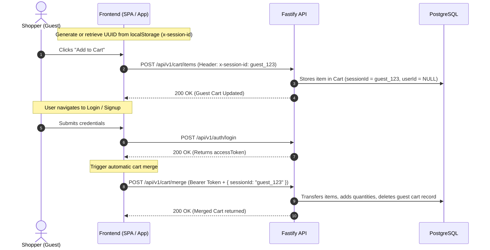

# 🔄 Guest Cart Sessions & Post-Login Cart Merge

This document explains the seamless cart preservation lifecycle for anonymous guest visitors transitioning to logged-in customers.

---

## 🎯 The Guest-to-User Transition Flow



---

## 📋 Endpoint: Merge Guest Cart

### Request
```http
POST /api/v1/cart/merge HTTP/1.1
Host: api.example.com
Authorization: Bearer <accessToken>
Content-Type: application/json

{
  "sessionId": "guest_sess_01J8R9XYZ"
}
```

### Response `200 OK`
```json
{
  "success": true,
  "message": "Guest cart successfully merged into customer account",
  "data": {
    "cartId": "cart_user_01J8R9QWE5566",
    "userId": "usr_01J8R9XYZ8877",
    "itemCount": 4,
    "subtotal": 244.95,
    "items": [
      {
        "id": "cart_item_merged_01",
        "variantId": "var_cyan_sz10_01",
        "productTitle": "Ultra-light Performance Running Shoes",
        "quantity": 2,
        "unitPrice": 99.99,
        "lineTotal": 199.98
      }
    ]
  }
}
```

---

## 💻 Frontend Helper Implementation (TypeScript)

```typescript
import { v4 as uuidv4 } from "uuid";

// 1. Ensure Guest Session ID exists in localStorage
export function getOrCreateSessionId(): string {
  let sessionId = localStorage.getItem("guest_session_id");
  if (!sessionId) {
    sessionId = `guest_${uuidv4()}`;
    localStorage.setItem("guest_session_id", sessionId);
  }
  return sessionId;
}

// 2. Perform Post-Login Merge
export async function handlePostLoginCartMerge(accessToken: string) {
  const sessionId = localStorage.getItem("guest_session_id");
  if (!sessionId) return;

  try {
    const response = await fetch("http://localhost:5000/api/v1/cart/merge", {
      method: "POST",
      headers: {
        "Content-Type": "application/json",
        Authorization: `Bearer ${accessToken}`,
      },
      body: JSON.stringify({ sessionId }),
    });

    if (response.ok) {
      // Clean up guest session ID once merged
      localStorage.removeItem("guest_session_id");
    }
  } catch (err) {
    console.error("Cart merge error:", err);
  }
}
```
