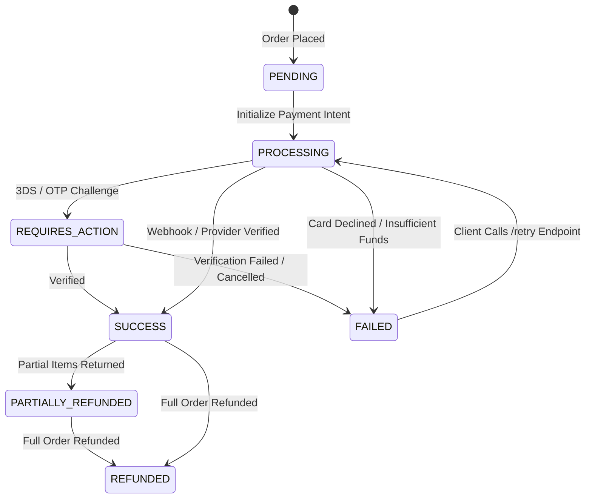

# 🔄 Payment Verification, Retries & Refund Status

This guide details polling payment outcomes, handling 3D-Secure challenges, retrying failed transactions without abandoning the order, and inspecting refund statuses.

---

## 📋 Endpoints Overview

| Method | Endpoint | Access | Purpose |
| :--- | :--- | :--- | :--- |
| `GET` | `/api/v1/payments/:id` | Guest / Authenticated | Fetch current payment breakdown, attempts & status |
| `POST` | `/api/v1/payments/retry` | Guest / Authenticated | Re-attempt payment with a new attempt sequence |

---

## 1. Inspect Payment Status

### Request
```http
GET /api/v1/payments/pay_01J8R9QWE112233 HTTP/1.1
Host: api.example.com
Authorization: Bearer <accessToken>
```

### Response `200 OK` (Payment Succeeded)
```json
{
  "success": true,
  "data": {
    "id": "pay_01J8R9QWE112233",
    "orderId": "ord_01J8R9XYZ998877",
    "provider": "STRIPE",
    "status": "SUCCESS",
    "amount": 105.28,
    "currency": "USD",
    "transactionId": "txn_stripe_3MtwBwLkdIwHu7ix",
    "paymentMethod": "CARD",
    "attemptsCount": 1,
    "attempts": [
      {
        "attemptNumber": 1,
        "status": "SUCCESS",
        "gatewayResponseCode": "succeeded",
        "createdAt": "2026-09-12T07:24:20.000Z"
      }
    ],
    "refunds": [],
    "createdAt": "2026-09-12T07:24:10.000Z",
    "updatedAt": "2026-09-12T07:24:22.000Z"
  }
}
```

---

## 2. Retry Failed Payment

If a card is declined or authentication fails, the customer can switch payment methods or retry on the same order.

### Request
```http
POST /api/v1/payments/retry HTTP/1.1
Host: api.example.com
Authorization: Bearer <accessToken>
Content-Type: application/json

{
  "paymentId": "pay_01J8R9QWE112233",
  "paymentMethod": "UPI"
}
```

### Response `200 OK`
```json
{
  "success": true,
  "message": "Payment retry attempt initialized",
  "data": {
    "paymentId": "pay_01J8R9QWE112233",
    "attemptNumber": 2,
    "status": "PROCESSING",
    "gatewayData": {
      "clientSecret": "pi_new_secret_..."
    }
  }
}
```

---

## 3. Payment Status Lifecycle State Machine


