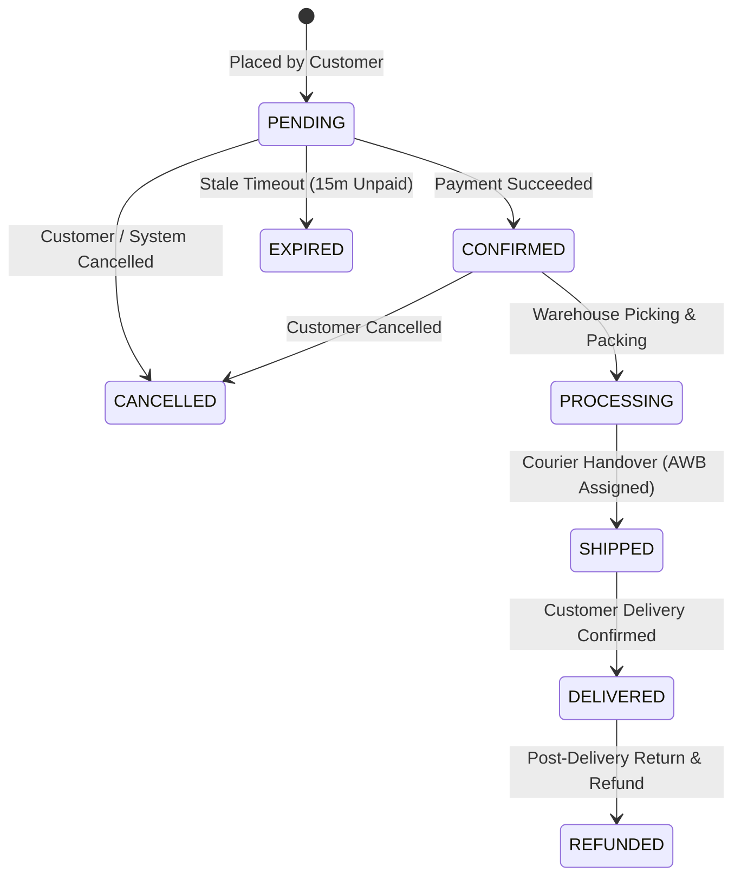

# 🚚 Order Tracking & Logistics Progression

This document describes how customers track their order fulfillment progress, courier dispatch status, Air Waybill (AWB) numbers, and carrier tracking URLs.

---

## 📦 Order Lifecycle State Machine



---

## 📋 Tracking Data Structure

When an order is updated by warehouse operations and carrier dispatch, the order details payload includes logistics parameters:

```json
{
  "orderId": "ord_01J8R9XYZ998877",
  "orderNumber": "ORD-20260912-7891",
  "status": "SHIPPED",
  "tracking": {
    "carrier": "FedEx Express",
    "trackingNumber": "FDX-9988-12345678",
    "trackingUrl": "https://www.fedex.com/fedextrack/?trknbr=FDX-9988-12345678",
    "estimatedDelivery": "2026-09-15T18:00:00.000Z",
    "shippedAt": "2026-09-13T09:30:00.000Z"
  },
  "statusHistory": [
    {
      "status": "PENDING",
      "timestamp": "2026-09-12T07:24:00.000Z",
      "note": "Order placed"
    },
    {
      "status": "CONFIRMED",
      "timestamp": "2026-09-12T07:24:45.000Z",
      "note": "Payment verified"
    },
    {
      "status": "PROCESSING",
      "timestamp": "2026-09-12T11:00:00.000Z",
      "note": "Package assembled at Central Warehouse"
    },
    {
      "status": "SHIPPED",
      "timestamp": "2026-09-13T09:30:00.000Z",
      "note": "Handed to courier FedEx Express"
    }
  ]
}
```

---

## 💻 Frontend Tracking Visual Stepper Example (React)

```tsx
import React from "react";

const ORDER_STEPS = ["PENDING", "CONFIRMED", "PROCESSING", "SHIPPED", "DELIVERED"];

export const OrderTrackingStepper = ({ currentStatus, tracking }: { currentStatus: string; tracking?: any }) => {
  const currentIndex = ORDER_STEPS.indexOf(currentStatus);

  return (
    <div className="p-6 bg-white border rounded-lg shadow-sm">
      <div className="flex justify-between items-center mb-8">
        {ORDER_STEPS.map((step, idx) => {
          const isDone = idx <= currentIndex;
          const isCurrent = idx === currentIndex;
          return (
            <div key={step} className="flex flex-col items-center flex-1 relative">
              <div
                className={`w-10 h-10 rounded-full flex items-center justify-center font-bold text-sm ${
                  isDone ? "bg-green-600 text-white" : "bg-gray-200 text-gray-500"
                } ${isCurrent ? "ring-4 ring-green-200" : ""}`}
              >
                {idx + 1}
              </div>
              <span className={`text-xs mt-2 font-medium ${isCurrent ? "text-green-700 font-bold" : "text-gray-600"}`}>
                {step}
              </span>
            </div>
          );
        })}
      </div>

      {tracking?.trackingNumber && (
        <div className="bg-blue-50 border border-blue-200 rounded p-4 flex justify-between items-center">
          <div>
            <p className="text-sm text-blue-800 font-medium">Carrier: {tracking.carrier}</p>
            <p className="text-xs text-blue-600">AWB: {tracking.trackingNumber}</p>
          </div>
          {tracking.trackingUrl && (
            <a
              href={tracking.trackingUrl}
              target="_blank"
              rel="noreferrer"
              className="bg-blue-600 text-white px-4 py-2 text-xs font-semibold rounded hover:bg-blue-700"
            >
              Track on Courier Site &rarr;
            </a>
          )}
        </div>
      )}
    </div>
  );
};
```
