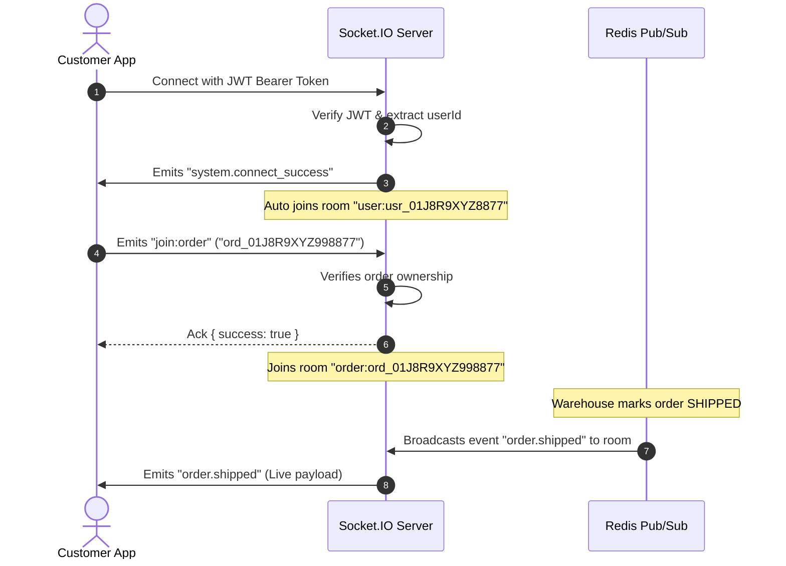

# ⚡ Real-Time WebSockets (Live Order Tracking & Push Alerts)

The platform provides a bi-directional WebSocket connection via **Socket.IO**, backed by Redis Pub/Sub. Authenticated customers can subscribe to live order status transitions, delivery progress alerts, and instant customer notifications without polling.

---

## 🌐 WebSocket Connection Parameters

- **Socket URL**: `http://localhost:5000` (or `https://api.example.com`)
- **Path**: `/socket.io`
- **Authentication**: JWT token sent via `auth.token` payload or `query.token`.

---

## 📡 Client Connection Lifecycle



---

## 🔔 Supported Customer Realtime Events

| Event Name | Room Target | Description |
| :--- | :--- | :--- |
| `order.confirmed` | `order:<orderId>` / `user:<userId>` | Payment confirmed, stock committed |
| `order.processing` | `order:<orderId>` / `user:<userId>` | Warehouse packaging in progress |
| `order.shipped` | `order:<orderId>` / `user:<userId>` | Order dispatched with carrier AWB |
| `order.delivered` | `order:<orderId>` / `user:<userId>` | Delivery confirmed by courier |
| `order.cancelled` | `order:<orderId>` / `user:<userId>` | Order cancelled & refund initiated |
| `payment.success` | `user:<userId>` | Payment successfully received |
| `notification.created` | `user:<userId>` | Instant bell notification for promo / account alerts |

---

## 💻 Frontend Socket.IO Client Example (TypeScript)

```typescript
import { io, Socket } from "socket.io-client";

let socket: Socket | null = null;

export function initCustomerSocket(accessToken: string): Socket {
  if (socket) return socket;

  socket = io("http://localhost:5000", {
    path: "/socket.io",
    auth: {
      token: accessToken,
    },
    transports: ["websocket", "polling"],
  });

  socket.on("system.connect_success", (data) => {
    console.log("Connected to Realtime WebSocket:", data);
  });

  // Global user notification listener
  socket.on("notification.created", (notification) => {
    console.log("New Notification:", notification);
  });

  return socket;
}

// Subscribe to a specific order's real-time events
export function subscribeToOrderTracking(
  orderId: string,
  onStatusUpdate: (eventData: any) => void
) {
  if (!socket) return;

  // Request to join the secure order room
  socket.emit("join:order", orderId, (response: { success: boolean; error?: string }) => {
    if (!response.success) {
      console.error("Failed to subscribe to order:", response.error);
    } else {
      console.log(`Subscribed to live updates for order ${orderId}`);
    }
  });

  // Listen to order state events
  const orderEvents = [
    "order.confirmed",
    "order.processing",
    "order.shipped",
    "order.delivered",
    "order.cancelled",
  ];

  orderEvents.forEach((eventName) => {
    socket?.on(eventName, (payload) => {
      if (payload.data?.orderId === orderId) {
        onStatusUpdate(payload.data);
      }
    });
  });
}
```
