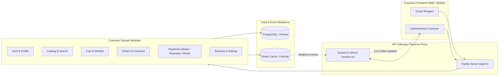

# 🛍️ Customer E-Commerce API Documentation

Welcome to the comprehensive **Customer API Reference & Integration Guide** for the E-Commerce Platform. This documentation details all customer-facing endpoints, workflows, data models, real-time WebSocket interactions, and best practices.

---

## 📌 Architecture & Quick Reference



---

## 📁 Documentation Index

| Module | Category | Description | Primary Docs |
| :--- | :--- | :--- | :--- |
| **01** | **Auth & Profile** | Customer Registration, Login, OAuth, Profile, Addresses, Phone OTP | [Customer Auth](01-auth-and-profile/01-customer-auth.md)<br>[Profile & Phone](01-auth-and-profile/02-profile-and-phone.md)<br>[Saved Addresses](01-auth-and-profile/03-saved-addresses.md) |
| **02** | **Catalog & Discovery** | Product Listings, Filters, Detail Pages, Variants, Search, Suggestions | [Display Products](02-catalog-and-discovery/01-display-products.md)<br>[Product Details](02-catalog-and-discovery/02-product-details.md)<br>[Search & Discovery](02-catalog-and-discovery/03-search-and-discovery.md) |
| **03** | **Shopping Cart** | Active Cart, Add Items, Update Quantities, Guest Cart Session & Merge | [Cart Management](03-shopping-cart/01-cart-management.md)<br>[Guest Cart & Merge](03-shopping-cart/02-guest-session-and-merge.md) |
| **04** | **Wishlist** | Customer Saved Items, Favorite Toggles, Direct Transfer to Cart | [Wishlist Management](04-wishlist/01-wishlist-management.md) |
| **05** | **Coupons & Discounts** | Coupon Validation, Threshold Calculations, Customer Redemption History | [Coupons & Promotions](05-coupons-and-discounts/01-coupons-and-promotions.md) |
| **06** | **Checkout & Orders** | Pre-checkout Breakdown, Atomic Order Placement, Order History & Cancel | [Checkout Validation](06-checkout-and-orders/01-checkout-validation.md)<br>[Place Order](06-checkout-and-orders/02-place-order.md)<br>[Order History](06-checkout-and-orders/03-customer-orders-history.md) |
| **07** | **Payments** | Payment Intents, Stripe / Razorpay / Mock Integration, Payment Retries | [Payment Initialization](07-payments/01-payment-intent-initialization.md)<br>[Payment Retries & Status](07-payments/02-payment-status-and-retries.md) |
| **08** | **Tracking & Realtime** | Order State Machine, Logistics Carrier AWB Tracking, WebSocket Live Updates | [Order Tracking](08-order-tracking-and-realtime/01-order-tracking.md)<br>[Realtime WebSockets](08-order-tracking-and-realtime/02-realtime-sockets.md) |
| **09** | **Reviews & Ratings** | Star Ratings, Breakdown Summaries, Verified Buyer Reviews, Helpfulness Votes | [Product Reviews](09-reviews-and-ratings/01-product-reviews-and-ratings.md)<br>[Submit & Manage Reviews](09-reviews-and-ratings/02-submit-and-manage-reviews.md) |

---

## 🌐 Environments & Base URLs

| Environment | Base REST URL | WebSocket URL |
| :--- | :--- | :--- |
| **Local Development** | `http://localhost:5000/api/v1` | `ws://localhost:5000/socket.io` |
| **Staging** | `https://staging-api.example.com/api/v1` | `wss://staging-api.example.com/socket.io` |
| **Production** | `https://api.example.com/api/v1` | `wss://api.example.com/socket.io` |

---

## 🔑 Global Headers & Conventions

All API requests and responses adhere to JSON standards (`application/json`).

| Header Name | Required | Description | Example |
| :--- | :--- | :--- | :--- |
| `Authorization` | Optional / Required | Bearer JWT access token for authenticated customer requests | `Bearer eyJhbGciOi...` |
| `x-session-id` | Optional (Guest) | Guest shopper session identifier to persist cart across browser tabs | `guest_sess_01J8R9XYZ` |
| `Idempotency-Key` | Recommended for Checkout | Unique UUID preventing duplicate payments or orders on network retries | `idem_01J8R9QWERT123` |
| `X-CSRF-Token` | Required for Cookie Mutations | Double-submit CSRF prevention token fetched via `/api/v1/auth/csrf` | `dGhpcy1pcy1hLWNzcmYtdG9rZW4=` |
| `x-request-id` | Auto / Optional | Distributed tracing correlation ID | `req_01J8R9XYZABC` |

---

## 🚦 Standard Error Response Envelope

When an operation fails or validation errors occur, the server returns a structured response envelope:

```json
{
  "success": false,
  "statusCode": 400,
  "error": "BAD_REQUEST",
  "message": "The requested variant does not have enough stock available.",
  "details": [
    {
      "field": "quantity",
      "issue": "Requested quantity 12 exceeds available stock 5"
    }
  ],
  "timestamp": "2026-09-12T07:25:00.000Z",
  "requestId": "req_01J8R9XYZABC"
}
```

---

## 🛡️ Security Best Practices for Frontend Clients

1. **Token Storage**: Store short-lived Access Tokens in memory (React state / Pinia store / Zustand) and long-lived Refresh Tokens in HTTP-only, secure, SameSite cookies.
2. **Guest Cart Migration**: Generate a client `x-session-id` on initial page load and store it in `localStorage`. Pass it in the header for all cart/order preview calls. Upon successful login, call `/api/v1/cart/merge` to transition guest items.
3. **Idempotency**: Always pass an `Idempotency-Key` header during `/api/v1/orders/checkout` and `/api/v1/payments/initialize` to avoid accidental duplicate orders due to network timeouts.
